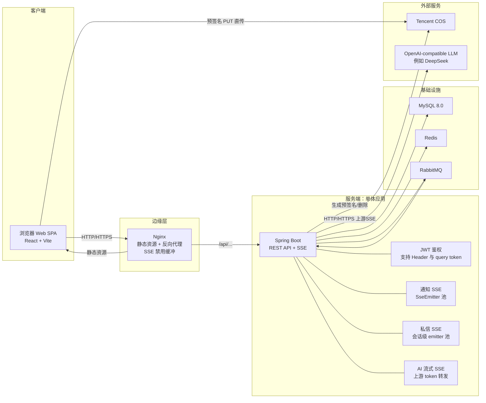
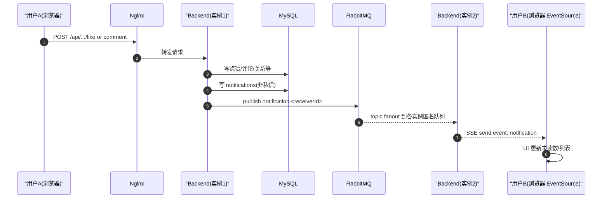
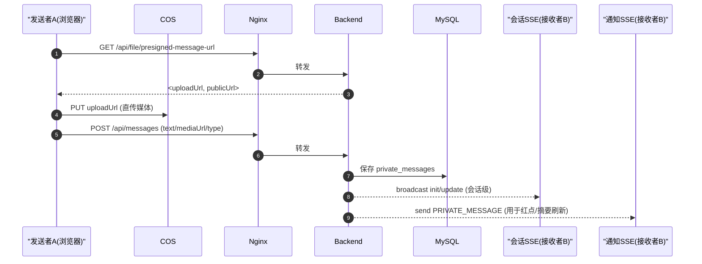
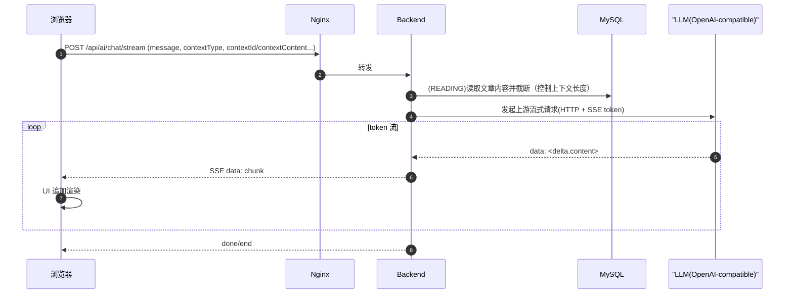
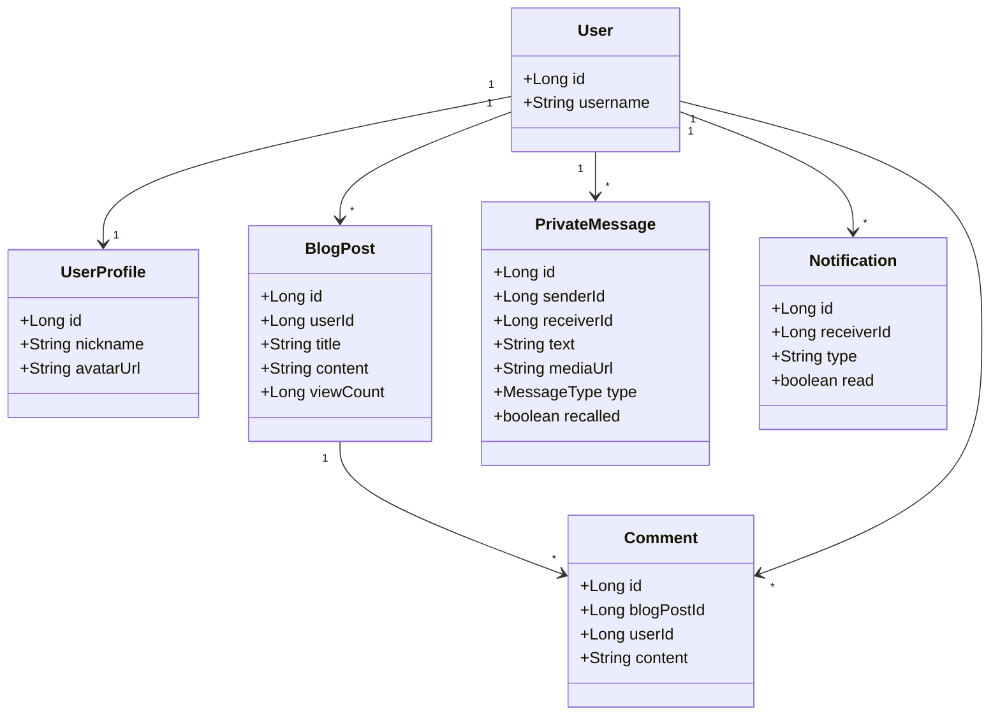

# 系统设计文档

## 1. 背景与总体目标

本系统是一个轻社交博客平台，提供：

- 内容：文章发布/编辑（Markdown + 富文本）、目录/标签、封面与媒体
- 互动：点赞、收藏、评论/回复、转发/分享
- 社交：关注、好友申请/好友关系、消息（私信）
- 实时：通知、好友申请、私信会话实时更新、AI 流式输出
- 智能助手：辅助阅读/理解文章、辅助写作/编辑，支持流式输出与附件（图片/文本）

核心设计原则：

- 前后端分离，前端静态资源由 Nginx 托管，API 由 Nginx 反代到后端
- 实时能力优先采用 SSE（Server-Sent Events），在“多实例/多进程”场景用 RabbitMQ 解决跨实例广播
- 上传链路尽量让浏览器直传 COS（预签名 URL），后端只做授权与元信息管理
- 认证与鉴权使用 JWT，无状态；为 EventSource/SSE 兼容，支持 query 参数 token

文档约定：

- API 统一前缀：`/api`（前端 Nginx 反代到后端）
- 通用响应包装：除少数特殊接口外，后端返回 `ApiResponse<T>`：
  - `code`：业务码（一般与 HTTP 状态码一致）
  - `msg`：提示信息
  - `data`：业务数据
- 分页返回结构：`PageResult<T>`：`{ list, total, page, size }`
- 鉴权方式：
  - 常规请求：`Authorization: Bearer <jwt>`
  - SSE/EventSource：可使用 query 参数 `token=<jwt>`（后端 Filter 支持）
- SSE 事件命名：
  - 通知类 SSE：优先发送命名事件 `notification`，并同时发送默认事件（前端可任选监听方式）
  - 私信会话 SSE：命名事件 `init`（首次）/ `update`（增量刷新）
  - AI 流式 SSE：默认事件，`data:` 行为纯文本 chunk；结束标志为 `[DONE]`

---

## 2. 技术选型与理由

### 2.1 前端

- React 18 + React Router DOM 7
  - 理由：组件化与生态成熟；路由方案稳定，适合 SPA。
  - 可选对比：Vue 3（更强的模板语法与官方配套），本项目更偏“组件复用 + 富交互”，React 生态更顺手。
- Vite
  - 理由：开发期启动/热更新快；构建产物简单，适合 Nginx 静态托管。
  - 可选对比：Webpack（配置更复杂，冷启动更慢）；Next.js（需要 SSR/ISR 时更合适，本项目为 SPA）。
- 编辑器：TipTap + Markdown（ReactMarkdown 等）
  - 理由：同时覆盖富文本编辑与 Markdown 渲染；面向博客编辑场景。
- 实时：EventSource（SSE）
  - 理由：服务端单向推送足够；实现和运维成本低；对 Nginx 友好。
  - 可选对比：WebSocket（双向更强，但连接管理/心跳/网关更复杂）；本项目私信发送仍走 HTTP POST，实时更新走 SSE 即可。
- 本地缓存：IndexedDB
  - 理由：私信会话数据量大，IndexedDB 可持久化并支持索引；提升“进入会话/翻页”体验。

### 2.2 后端

- Spring Boot 3.5.x（仓库版本为 3.5.7）+ Java 17
  - 理由：生态成熟；与 Spring Security/JPA/Redis/AMQP 集成度高；Java 17 LTS。
- Spring MVC +（局部）WebFlux
  - 说明：整体是 MVC 为主；WebFlux 主要用于 WebClient 与上游 AI 的流式处理。
  - 理由：避免全链路响应式改造，但保留高效的流式消费能力。
- 数据访问：Spring Data JPA + MySQL 8
  - 理由：领域模型清晰、CRUD 多；JPA 能快速交付。
  - 可选对比：MyBatis（SQL 控制更细但样板更多）；本项目业务迭代快，JPA 更合适。
- 缓存与计数：Redis
  - 理由：浏览量/去重/队列等写多读多场景更适合内存型 KV；并可用于异步落库缓冲。
- 消息队列：RabbitMQ（Spring AMQP）
  - 理由：解决“通知 SSE 长连接分散在不同后端实例”的跨实例投递；topic routingKey 简单直观。
  - 可选对比：Kafka（吞吐更高但运维复杂）；本项目更偏业务事件通知而非大数据流。
- 认证：Spring Security + JWT（无状态）
  - 理由：适合前后端分离与多实例；不依赖 Session。
- 对象存储：Tencent COS
  - 理由：媒体文件上云、降低后端带宽；配合预签名 URL 实现安全直传。
- 智能助手：OpenAI-compatible HTTP API（后端通过 WebClient 调用并支持流式转发）
  - 理由：兼容 OpenAI 接口形态，便于替换供应商；支持上游 SSE token 流。

> 注：仓库配置中 Flyway 默认关闭（`spring.flyway.enabled=false`），当前不把 Flyway 作为“运行时必需”组件描述。

---

## 3. 系统架构设计

### 3.1 总体架构（逻辑视图）



形态说明：

- 后端为单体 Spring Boot（非微服务拆分）
- 依赖外部基础设施组件（MySQL/Redis/RabbitMQ/COS/LLM），可按“单体应用 + 外部依赖”方式部署与扩展

### 3.2 物理部署（Docker Compose）

系统默认通过 Docker Compose 部署：

- `mysql:8.0`：持久化卷 `mysql_data`
- `redis:alpine`
- `rabbitmq:3-management`：管理控制台端口映射到 `127.0.0.1:15672`
- `backend`：构建后运行 Spring Boot JAR（容器内端口 8080）
- `frontend`：Nginx 托管前端静态资源，对外暴露 80

关键点：

- Nginx 对 `/api/` 反代到 `backend:8080`
- SSE 相关路径禁用 `proxy_buffering`，避免消息被缓冲导致“实时性丢失”
- MySQL/RabbitMQ 的端口仅绑定到 `127.0.0.1`，避免直接暴露到公网（降低攻击面）

### 3.3 编译产物与运行产物

- 前端：Vite 构建输出 `dist/`，由 Nginx 容器托管
- 后端：Maven 构建输出 `target/*.jar`，由 OpenJDK 17 运行

---

## 4. 模块划分与关键组件（以代码为准）

### 4.1 后端模块与职责

- `controller/`：HTTP API 与 SSE endpoint
- `service/`：业务编排（文章/评论/私信/通知/好友/AI 等）
- `repository/`：JPA 数据访问
- `model/`：实体与领域对象
- `dto/`：对外数据结构
- `events/`：SSE 发布器、RabbitMQ Bridge（跨实例通知）
- `config/`：Security、JWT filter、AI client、CORS 等

#### 4.1.1 认证鉴权（JWT）

- 典型请求：`Authorization: Bearer <token>`
- SSE/EventSource 兼容：支持 query 参数 `token=<jwt>`（因为浏览器 EventSource 无法自定义 Header）

#### 4.1.2 实时通知（SSE + RabbitMQ）

系统存在两层“通知推送”机制：

1) **本实例推送**：
- 使用 `SseEmitter` 管理 `userId -> emitters`（同一用户可多端、多标签页连接）
- 发送事件时优先发命名事件（例如 `notification`），前端可按事件名监听

2) **跨实例转发**：
- RabbitMQ 采用 TopicExchange + 每实例匿名队列（`AnonymousQueue`）
- 发布 routingKey：`notification.{receiverId}`
- 每个实例队列绑定 `notification.#`，因此任一实例发布后，所有实例都能收到消息，再各自转发给本机内持有的 SSE 连接

> 这样解决了：用户的 SSE 连接可能落在任意实例；单实例内存 emitter 池无法跨实例访问。

#### 4.1.3 私信实时（会话级 SSE）

- 会话 SSE 以 `min(userId, otherId)-max(userId, otherId)` 作为会话 key 维护 emitter 集合
- 发送私信（文本/图片/视频）走 HTTP API，成功后通过会话 SSE `broadcast` 推送 `init/update`
- 撤回：限制在短时间窗口内（代码中为 2 分钟），若是媒体消息会同时删除 COS 对象

此外，系统还会发出“私信通知（红点/摘要刷新）”：

- 私信 DTO 服务会构造 `type=PRIVATE_MESSAGE` 的通知 DTO，并调用 `NotificationService.sendNotification(receiverId, dto)`
- 该类通知用于“全局红点/列表刷新”，通常不落库（通知服务对 PRIVATE_MESSAGE 有特殊处理）

#### 4.1.4 浏览量与记录（Redis 增量 + 批量落库）

目标：避免每次浏览都直接写 MySQL，减少热点更新。

实现策略：

- 去重：
  - 登录用户：Redis Set（24h）去重 + DB 永久去重
- 计数：
  - Redis `INCR` 维护增量（delta）
  - Redis Set 维护待落库文章集合
- 明细：
  - 将浏览记录写入 Redis List 队列，后续批量落库
- 定时任务：
  - 固定间隔（例如 5s）批量同步：Lua 脚本原子 GET+DEL 取走 delta，再事务写入 MySQL

该模式的关键优点：

- MySQL 从“高频小更新”变为“低频批处理”
- 保留浏览明细（可做统计/反作弊/用户轨迹）

#### 4.1.5 文件上传（COS 预签名直传）

本系统把“占空间、占带宽”的媒体文件从 CVM 服务器剥离到 COS：

- **上传链路不经过后端转发**：后端只负责签发预签名 URL（授权），浏览器拿到 `uploadUrl` 后直接向 COS 发起 `PUT`。
- **服务器磁盘几乎不增长**：媒体文件不落在后端容器文件系统；后端通常只在 MySQL 中保存媒体的访问 URL（或对象 key），并在需要时提供删除。

关键接口（与实现保持一致）：

- 文章/通用上传预签名：`GET /api/file/presigned-url`
- 私信媒体上传预签名：`GET /api/file/presigned-message-url`

典型交互流程：

1) 前端向后端请求预签名：后端基于用户身份、业务类型（文章/私信）与约定路径生成 COS 对象 key，并返回：

- `uploadUrl`：带签名的 PUT URL（短期有效）
- `publicUrl`：前端用于展示/引用的访问地址（可为 CDN URL 或可路由的对象路径）

2) 前端 `PUT uploadUrl`：直接把二进制内容写入 COS（不占用 CVM 磁盘与上行带宽）。

3) 前端把 `publicUrl`（或媒体字段）连同业务数据一并提交到后端：例如发布文章、发送私信。

4) 删除与撤回：后端在撤回私信等场景会调用 COS SDK 删除对象（避免“撤回但文件仍可访问”）。

为什么该设计能“不占用服务器空间”：

- 在 `docker-compose.yml` 中，后端容器只挂载 `./sources:/app/sources` 作为本地资源目录；但核心媒体上传并不写入该目录，而是直传 COS。
- Nginx 配置允许对部分路径进行反代/回源策略，但媒体的“最终存储”仍在 COS（必要时可结合 COS CDN 加速与回源）。

安全与成本上的收益：

- **成本**：CVM 不再承担大文件存储与出网；COS + CDN 更适合静态内容分发。
- **可靠性**：容器重建不会影响媒体文件；对象存储更适合高可用与备份。
- **权限控制**：预签名 URL 有有效期与方法限制（PUT），降低泄漏风险。

### 4.2 前端模块与职责

- 页面：`pages/*`（首页、文章详情、编辑器、消息中心、通知中心等）
- 组件：
  - 文章详情组件、评论区、侧边栏
  - 编辑器组件（MarkdownEditor/TipTapEditor 等）
  - 全局导航与通知入口（Navbar/NotificationBell）
- Context：
  - `AiAssistantContext`：封装 AI 对话与流式解析
  - 主题、背景、上传状态等

#### 4.2.1 前端 SSE 订阅点（与后端配套）

- 通知红点：通过 EventSource 订阅通知 SSE（监听命名事件 `notification`）
- “全局聚合通道”：导航栏会订阅好友/通知相关 SSE，并根据 `type` 分流（例如 `PRIVATE_MESSAGE` 触发私信未读刷新）
- 私信会话页：订阅会话 SSE，收到 `init/update` 刷新列表；失败回退轮询

#### 4.2.2 私信本地缓存（IndexedDB）

- `messages/conversations/meta` 三个 store
- 对消息按 `conversationKey + createdAt` 建索引
- 缓存策略：预加载摘要、写入新消息、定期 trim，保证空间可控

#### 4.2.3 AI 流式消费

- 前端优先使用 `fetch` POST 方式消费后端的 SSE 流（手写解析 `data:` 行）
- 若流式失败，回退到非流式接口
- UI 侧可对“逐 token 增量”进行渲染，以获得打字机效果

---

## 5. 接口设计（前后端对齐，全量清单）

本章包含两部分：

1) 前端路由与页面职责（SPA 入口）
2) 后端 HTTP/SSE 接口清单（按控制器归类）

如需核对源代码：后端接口集中在 `backend/src/main/java/com/kirisamemarisa/blog/controller/` 与 `backend/src/main/java/com/kirisamemarisa/blog/ai/`。

### 5.1 前端路由（React Router）

路由定义位于 `front/src/App.jsx`。

| 路径 | 页面组件 | 主要职责 | 典型后端接口 |
|---|---|---|---|
| `/`、`/home` | `Home` | 首页信息流、分类/排序、卡片列表 | `GET /api/blogpost`、`POST /api/blogview/batch` |
| `/welcome` | `Welcome` | 欢迎页/引导 | - |
| `/post/:id` | `ArticleDetail` | 文章详情、点赞/收藏/分享、评论/回复、阅读统计 | `GET /api/blogpost/{id}`、`POST /api/blogview/record`、`POST /api/blogpost/{id}/like`、`POST /api/blogpost/{id}/favorite`、`POST /api/blogpost/{id}/share`、`GET /api/comment/list/{blogPostId}`、`POST /api/blogpost/comment`、`POST /api/comment-reply` |
| `/blog-edit` | `BlogEditor` | 写作/编辑、上传封面/媒体 | `POST /api/blogpost`、`PUT /api/blogpost/{id}`、`POST /api/blogpost/withcover`、`POST /api/blogpost/{id}/withcover`、`GET /api/blogpost/presigned-url`、`POST /api/blogpost/media` |
| `/selfspace` | `SelfSpace` | 个人空间、文章管理、资料编辑入口 | `GET /api/user/profile/{userId}`、`PUT /api/user/profile/{userId}`、`GET /api/blogpost?userId=...`、`DELETE /api/blogpost/{id}` |
| `/favorites` | `FavoritesPage` | 收藏夹 | `GET /api/blogpost/favorites`、`GET /api/blogpost/favorites/categories` |
| `/search` | `SearchPage` | 文章搜索 | `GET /api/blogpost?keyword=...` |
| `/users/search` | `UserSearch` | 用户搜索 | `GET /api/users/search` |
| `/follows` | `FollowingList` | 关注列表 | `GET /api/follow/following`、`DELETE /api/follow/{targetId}` |
| `/friends/pending` | `PendingFriendRequests` | 待处理好友申请 | `GET /api/friends/pending`、`POST /api/friends/respond/{requestId}` |
| `/messages` | `CommunicationPage` | 私信会话列表、好友列表入口 | `GET /api/messages/conversation/list`、`GET /api/messages/unread/total` |
| `/conversation/:otherId` | `CommunicationPage`/`ConversationDetail` | 会话详情、发消息、撤回/删除、会话 SSE | `GET /api/messages/conversation/{otherId}`、`POST /api/messages`、`POST /api/messages/recall`、`POST /api/messages/delete`、`GET /api/messages/subscribe/{otherId}` |
| `/notifications` | `NotificationCenter` | 通知中心、按类型过滤、标记已读 | `GET /api/notifications`、`GET /api/notifications/unread-count`、`PUT /api/notifications/{id}/read`、`PUT /api/notifications/read-all` |
| `/security` | `SecurityCenter` | 安全中心（改密等） | `POST /api/user/change-password` |

### 5.2 后端接口清单（HTTP + SSE）

#### 5.2.1 用户（`/api/user`）

| 方法 | 路径 | 鉴权 | 请求 | 返回 |
|---|---|---|---|---|
| POST | `/api/user/register` | 否 | JSON：`UserRegisterDTO` | `ApiResponse<Long>`（新用户 ID） |
| POST | `/api/user/login` | 否 | JSON：`UserLoginDTO` | `ApiResponse<LoginResponseDTO>` |
| GET | `/api/user/profile/{userId}` | 否 | Path：`userId` | `ApiResponse<UserProfileDTO>` |
| PUT | `/api/user/profile/{userId}` | 是（本人） | JSON：`UserProfileDTO` | `ApiResponse<Void>` |
| POST | `/api/user/profile/{userId}/avatar` | 是（本人） | `multipart/form-data`：`file` | `ApiResponse<String>`（url） |
| POST | `/api/user/profile/{userId}/background` | 是（本人） | `multipart/form-data`：`file` | `ApiResponse<String>` |
| POST | `/api/user/profile/{userId}/qq-qrcode` | 是（本人） | `multipart/form-data`：`file` | `ApiResponse<String>` |
| POST | `/api/user/profile/{userId}/wechat-qrcode` | 是（本人） | `multipart/form-data`：`file` | `ApiResponse<String>` |
| POST | `/api/user/change-password` | 是 | JSON：`ChangePasswordDTO` | `ApiResponse<Void>` |
| GET | `/api/user/{userId}/stats` | 否 | Path：`userId` | `ApiResponse<UserStatsDTO>` |

#### 5.2.2 文章（`/api/blogpost`）

| 方法 | 路径 | 鉴权 | 请求 | 返回 |
|---|---|---|---|---|
| POST | `/api/blogpost` | 是 | JSON：`BlogPostCreateDTO`（`userId` 由后端取当前用户） | `ApiResponse<Long>` |
| GET | `/api/blogpost/{id}` | 否（可带 token 以返回“是否点赞/收藏”） | Path：`id` | `ApiResponse<BlogPostDTO>` |
| GET | `/api/blogpost` | 否 | Query：`page,size,keyword,userId,directory,categoryName,status,sortMode` | `ApiResponse<PageResult<BlogPostDTO>>` |
| PUT | `/api/blogpost/{id}` | 通常需要（由 Service 控制权限） | JSON：`BlogPostUpdateDTO` | `ApiResponse<Boolean>` |
| DELETE | `/api/blogpost/{id}` | 是 | Query：`userId`（后端会覆盖为当前用户） | `ApiResponse<Boolean>` |
| GET | `/api/blogpost/directories` | 是（本人） | Query：`userId` | `ApiResponse<List<String>>` |
| GET | `/api/blogpost/favorites` | 是（本人） | Query：`userId,categoryName,page,size` | `ApiResponse<PageResult<BlogPostDTO>>` |
| GET | `/api/blogpost/favorites/categories` | 是（本人） | Query：`userId` | `ApiResponse<List<String>>` |
| GET | `/api/blogpost/top-per-category` | 否 | - | `ApiResponse<List<BlogPostDTO>>` |
| POST | `/api/blogpost/{id}/like` | 是 | Path：`id` | `ApiResponse<Boolean>` |
| POST | `/api/blogpost/{id}/favorite` | 是 | Path：`id` | `ApiResponse<Boolean>` |
| POST | `/api/blogpost/{id}/share` | 是 | Path：`id` | `ApiResponse<Boolean>` |

带封面表单（兼容旧前端）：

| 方法 | 路径 | 鉴权 | 请求 | 返回 |
|---|---|---|---|---|
| POST | `/api/blogpost/withcover` | 是 | `multipart/form-data`：`title,content,directory,categoryName,tags,status,cover` | `ApiResponse<Long>` |
| POST | `/api/blogpost/{id}/withcover` | 通常需要 | `multipart/form-data`：`title,content,directory,categoryName,tags,status,cover,removeCover` | `ApiResponse<Boolean>` |

编辑器媒体与直传：

| 方法 | 路径 | 鉴权 | 请求 | 返回 |
|---|---|---|---|---|
| GET | `/api/blogpost/presigned-url` | 是（视频需 VIP） | Query：`fileName` | `ApiResponse<Map<String,String>>`（`uploadUrl/publicUrl` 等） |
| POST | `/api/blogpost/media` | 是（视频需 VIP） | `multipart/form-data`：`file` | `ApiResponse<String>`（本地/回源 url） |

#### 5.2.3 评论与回复（`/api/comment`、`/api/comment-reply`、以及文章下评论快捷接口）

说明：仓库中存在两套“新增评论”入口：`POST /api/comment` 与 `POST /api/blogpost/comment`，两者最终都写入评论体系。前端当前主要调用 `POST /api/blogpost/comment`。

| 方法 | 路径 | 鉴权 | 请求 | 返回 |
|---|---|---|---|---|
| POST | `/api/blogpost/comment` | 由 Service 控制（建议携带 token） | JSON：`CommentCreateDTO` | `ApiResponse<Long>` |
| GET | `/api/blogpost/{id}/comments` | 否 | Query：`page,size,currentUserId(可选)` | `ApiResponse<PageResult<CommentDTO>>` |
| POST | `/api/blogpost/comment/{id}/like` | 是 | Path：`id` | `ApiResponse<Boolean>` |
| POST | `/api/comment` | 是 | JSON：`CommentCreateDTO`（`userId` 由后端覆盖） | `ApiResponse<Long>` |
| GET | `/api/comment/list/{blogPostId}` | 否 | Query：`page,size,currentUserId(可选)` | `ApiResponse<PageResult<CommentDTO>>` |
| POST | `/api/comment/{commentId}/like` | 是 | Path：`commentId` | `ApiResponse<Boolean>` |
| GET | `/api/comment/{commentId}` | 否 | - | `ApiResponse<CommentDTO>` |
| POST | `/api/comment-reply` | 是 | JSON：`CommentReplyCreateDTO`（`userId` 由后端覆盖） | `ApiResponse<Long>` |
| GET | `/api/comment-reply/list/{commentId}` | 否 | Query：`page,size,currentUserId(可选)` | `ApiResponse<PageResult<CommentReplyDTO>>` |
| POST | `/api/comment-reply/{replyId}/like` | 是 | Path：`replyId` | `ApiResponse<Boolean>` |
| GET | `/api/comment-reply/{replyId}` | 否 | - | `ApiResponse<CommentReplyDTO>` |

#### 5.2.4 关注（`/api/follow`）

| 方法 | 路径 | 鉴权 | 请求 | 返回 |
|---|---|---|---|---|
| POST | `/api/follow/{targetId}` | 是 | Path：`targetId` | `ApiResponse<Void>` |
| DELETE | `/api/follow/{targetId}` | 是 | Path：`targetId` | `ApiResponse<Void>` |
| GET | `/api/follow/followers` | 是 | Query：`page,size` | `ApiResponse<PageResult<UserSimpleDTO>>` |
| GET | `/api/follow/following` | 是 | Query：`page,size` | `ApiResponse<PageResult<UserSimpleDTO>>` |

#### 5.2.5 好友（`/api/friends`）

| 方法 | 路径 | 鉴权 | 请求 | 返回 |
|---|---|---|---|---|
| POST | `/api/friends/request/{targetId}` | 是 | JSON（可选）：`{ message }` | `ApiResponse<FriendRequestDTO>` |
| GET | `/api/friends/pending` | 是 | - | `ApiResponse<List<FriendRequestDTO>>` |
| POST | `/api/friends/respond/{requestId}` | 是 | Query：`accept=true/false` | `ApiResponse<FriendRequestDTO>` |
| DELETE | `/api/friends/{targetId}` | 是 | Path：`targetId` | `ApiResponse<Void>` |
| GET | `/api/friends/list` | 是 | - | `ApiResponse<List<UserSimpleDTO>>` |
| GET | `/api/friends/list/page` | 是 | Query：`page,size` | `ApiResponse<PageResult<UserSimpleDTO>>` |
| GET | `/api/friends/ids` | 是 | - | `ApiResponse<List<Long>>` |
| GET | `/api/friends/isFriend/{otherId}` | 是 | Path：`otherId` | `ApiResponse<Boolean>` |

好友/通知聚合 SSE：

| 方法 | 路径 | 鉴权 | 说明 |
|---|---|---|---|
| GET | `/api/friends/subscribe` | 是（支持 `?token=`） | SSE。初始 `init` 可能是待处理好友申请列表；后续默认事件通常为 `NotificationDTO`（含 `PRIVATE_MESSAGE` 等类型）。 |

#### 5.2.6 私信（`/api/messages`）

HTTP 接口：

| 方法 | 路径 | 鉴权 | 请求 | 返回 |
|---|---|---|---|---|
| GET | `/api/messages/conversation/list` | 是 | - | `ApiResponse<PageResult<ConversationSummaryDTO>>` |
| GET | `/api/messages/conversation/{otherId}` | 是 | Query：`page,size` | `ApiResponse<PageResult<PrivateMessageDTO>>` |
| GET | `/api/messages/unread/total` | 是 | - | `ApiResponse<Long>` |
| POST | `/api/messages/conversation/{otherId}/read` | 是 | - | `ApiResponse<Integer>`（标记已读条数） |
| POST | `/api/messages` | 是 | JSON：`{ receiverId, content }` | `ApiResponse<PrivateMessageDTO>` |
| POST | `/api/messages/text/{otherId}` | 是 | JSON：`PrivateMessageDTO`（用 `text` 字段） | `ApiResponse<PrivateMessageDTO>` |
| POST | `/api/messages/media/{otherId}` | 是 | JSON：`PrivateMessageDTO`（`type/mediaUrl/text`） | `ApiResponse<PrivateMessageDTO>` |
| POST | `/api/messages/recall` | 是 | JSON：`PrivateMessageOperationDTO`（`messageId`） | `ApiResponse<Boolean>` |
| POST | `/api/messages/delete` | 是 | JSON：`PrivateMessageOperationDTO`（`messageId`） | `ApiResponse<Boolean>` |
| POST | `/api/messages/upload` | 是 | `multipart/form-data`：`file`（`otherId` 可选） | `ApiResponse<String>`（url） |
| GET | `/api/messages/presigned-url` | 是 | Query：`fileName,otherId` | `ApiResponse<Map<String,String>>` |

会话 SSE：

| 方法 | 路径 | 鉴权 | 说明 |
|---|---|---|---|
| GET | `/api/messages/subscribe/{otherId}` | 是（支持 `?token=`） | SSE。必须带 Query：`userId=<当前用户ID>`。命名事件：`init`（初始历史，默认 20 条）与 `update`（会话刷新列表）。 |
| GET | `/api/messages/stream/{otherId}` | 是（建议携带 token） | SSE。返回历史列表并持续推送更新（同样由会话级 publisher 维护）。 |

#### 5.2.7 通知（`/api/notifications`）

| 方法 | 路径 | 鉴权 | 请求 | 返回 |
|---|---|---|---|---|
| GET | `/api/notifications/subscribe` | 是（支持 `?token=`） | - | SSE（命名事件 `notification` + 默认事件） |
| GET | `/api/notifications` | 是 | Query：`page,size,types(可选)` | `ApiResponse<PageResult<NotificationDTO>>` |
| GET | `/api/notifications/unread-count` | 是 | - | `ApiResponse<Long>` |
| GET | `/api/notifications/unread-stats` | 是 | - | `ApiResponse<Map<String,Long>>` |
| PUT | `/api/notifications/{id}/read` | 是 | Path：`id` | `ApiResponse<Void>` |
| PUT | `/api/notifications/read-all` | 是 | JSON（可选）：`List<String> types` | `ApiResponse<Void>` |

#### 5.2.8 浏览统计（`/api/blogview`）

| 方法 | 路径 | 鉴权 | 请求 | 返回 |
|---|---|---|---|---|
| POST | `/api/blogview/record` | 否（可带 userId） | JSON：`BlogViewRecordCreateDTO` | `ApiResponse<BlogViewStatsDTO>` |
| GET | `/api/blogview/{blogPostId}` | 否 | Path：`blogPostId` | `ApiResponse<BlogViewStatsDTO>` |
| POST | `/api/blogview/batch` | 否 | JSON：`List<Long>` | `ApiResponse<Map<Long,Long>>` |

#### 5.2.9 文件与直传（`/api/file`）

| 方法 | 路径 | 鉴权 | 请求 | 返回 |
|---|---|---|---|---|
| GET | `/api/file/presigned-url` | 建议携带 token | Query：`fileName` | `ApiResponse<Map<String,String>>` |
| GET | `/api/file/presigned-message-url` | 是 | Query：`fileName,otherId` | `ApiResponse<Map<String,String>>` |

#### 5.2.10 用户搜索（`/api/users/search`）

| 方法 | 路径 | 鉴权 | 请求 | 返回 |
|---|---|---|---|---|
| GET | `/api/users/search` | 否 | Query：`username` 或 `nickname`（二选一），以及 `page,size` | `ApiResponse<PageResult<UserSearchDTO>>` |

#### 5.2.11 智能助手（`/api/ai`）

说明：该模块的响应体不是 `ApiResponse<T>`，而是直接返回 `{ reply: ... }` 或 `{ error: ... }`。

| 方法 | 路径 | 鉴权 | 请求 | 返回 |
|---|---|---|---|---|
| POST | `/api/ai/chat` | 否（可带 token 供上下文取用户态） | JSON：`{ message, model? }` | `200: { reply }` |
| POST | `/api/ai/chat/attachments` | 否 | JSON：`{ message, model?, attachments: [...] }` | `200: { reply }` |
| POST | `/api/ai/chat/stream` | 否（建议携带 token） | JSON：`{ message, model?, contextType?, contextId?, contextContent? }` | SSE（纯文本 chunk，结束 `[DONE]`） |
| GET | `/api/ai/chat/stream` | 否 | Query：`message, model?` | SSE（legacy） |

`contextType` 取值：`READING`（阅读上下文）、`EDITING`（编辑上下文）、`GLOBAL`（通用）。

### 5.3 接口对齐说明（已知差异）

为避免“文档/前端/后端”出现三套口径，这里记录仓库当前可见的接口差异，便于后续统一：

- 前端 `fetchSelfProfile()` 使用 `/api/user/profile/me`，后端未提供该路径（后端为 `/api/user/profile/{userId}`）。
- 前端存在 `GET /api/blogpost/{id}/share-url` 的调用点，后端当前未实现该接口（现有分享入口为 `POST /api/blogpost/{id}/share`）。
- 前端私信撤回/删除的 body 使用 `{ id: messageId }`，后端 DTO 期望字段为 `{ messageId }`。

---

## 6. 关键业务场景（时序图 / 类图）

---

> 说明：以下场景用于说明关键链路在代码中的落地方式，重点覆盖：SSE、RabbitMQ、Redis、COS、智能助手流式输出。

### 6.1 场景 A：互动触发通知（点赞/评论）→ RabbitMQ → SSE → 前端红点



要点：

- 通知先落库（可追溯、可查询未读）
- 再经 RabbitMQ 跨实例广播（保证用户无论连接在哪个实例都能收到）
- 发送为命名事件 `notification`，前端可精确监听

### 6.2 场景 B：发送私信（媒体直传 COS）→ 保存 → 会话 SSE 更新 → 私信通知红点



要点：

- 媒体不经后端中转，降低后端带宽与存储压力
- 私信内容落库后，通过会话 SSE 让对话页面实时刷新
- 另发 `PRIVATE_MESSAGE` 通知给全局通道：让导航栏/列表做红点与摘要刷新

### 6.3 场景 C：智能助手（带上下文）→ 上游流式 → 后端转发 SSE → 前端增量渲染



要点：

- 阅读模式会注入文章上下文（并做长度上限截断，控制 prompt 体积）
- 后端负责把上游 token 流解析为“纯文本 chunk”再转发给前端
- 前端以 `fetch` 消费流并解析 `data:` 行，逐 chunk 更新聊天 UI

### 6.4（简化）领域模型类图



---

## 7. 开发与部署说明

### 7.1 本地开发（推荐流程）

1) 启动基础设施（MySQL/Redis/RabbitMQ）

- 使用 `docker-compose.yml`（可只起基础设施服务）

2) 启动后端

- 进入 `backend/`：使用 `./mvnw spring-boot:run` 或构建后运行
- 关键环境变量（至少）：
  - `DB_PASSWORD`、`JWT_SECRET`
  - `COS_SECRET_ID`/`COS_SECRET_KEY`/`COS_BUCKET_*`
  - `DEEPSEEK_API_KEY`、`DEEPSEEK_API_BASE_URL`

3) 启动前端

- 进入 `front/`：`npm install`，`npm run dev`
- Vite dev server 会把 `/api` 代理到 `VITE_BACKEND_ORIGIN`（默认 `http://localhost:8080`）

### 7.2 生产部署（Docker Compose）

- 准备 `.env`（或在部署环境注入变量）
- 执行 `docker compose up -d --build`

注意：

- SSE 需要 Nginx 禁用缓冲（项目已在 Nginx 配置中处理）
- 如需多后端实例：RabbitMQ 的跨实例通知桥能保证通知可达，但仍需额外的负载均衡层与实例编排策略

### 7.3 腾讯云服务器（CVM）部署要点（生产环境）

本项目的“线上形态”可以概括为：**一台腾讯云 CVM + Docker Compose**。

#### 7.3.1 推荐的资源与网络配置

- CVM：Linux（Ubuntu/CentOS 均可），CPU/内存按并发与图片/视频比例选择（至少 2C4G 起步更稳妥）
- 磁盘：系统盘用于容器与日志，数据盘主要用于 MySQL 数据卷（媒体文件不放本机）
- 安全组/防火墙：
  - 放行：`22`（仅管理员 IP）、`80`/`443`（Web 入口）
  - 不对公网放行：`3306`（MySQL）、`5672`/`15672`（RabbitMQ）、`6379`（Redis）

> 代码中的 `docker-compose.yml` 已将 MySQL `3306` 和 RabbitMQ 管理端 `15672` 绑定到 `127.0.0.1`，即默认不暴露到公网；生产仍应在安全组层面“二次确认”。

#### 7.3.2 域名与 HTTPS（建议）

- 域名解析：将域名 A 记录指向 CVM 公网 IP
- HTTPS：建议使用腾讯云 SSL 证书（或 ACME 方案）
  - 简化做法：在 `front/nginx.conf` 基础上加 443 server 块 + 证书挂载
  - 或：引入独立的反向代理网关（如 Nginx Proxy Manager / Traefik）统一管理证书与续期

SSE 相关注意：

- 需要禁用 Nginx 对 SSE 的缓冲（已在 Nginx 配置中对 `/api/sse/`、`/api/ai/chat/stream` 等路径设置 `proxy_buffering off`）
- 如启用 HTTPS，务必保持 `proxy_read_timeout` 足够大（否则长连接会被网关提前断开）

#### 7.3.3 Docker Compose 落地方式

目录与数据：

- MySQL 使用命名卷 `mysql_data` 持久化
- 项目根目录的 `./sources` 会挂载到后端与前端容器（用于部分本地资源/回源策略）
- 前端容器还挂载 `./site_assets`（用于站点静态资源）

建议的 `.env`/环境变量管理（与 compose 中变量一致）：

- 数据库：`DB_PASSWORD`
- RabbitMQ：`RABBITMQ_USER`、`RABBITMQ_PASS`、`RABBITMQ_EXCHANGE`
- JWT：`JWT_SECRET`（必须设置，避免默认生成导致重启后 token 失效）
- COS：`COS_SECRET_ID`、`COS_SECRET_KEY`、`COS_BUCKET_REGION`、`COS_BUCKET_NAME`、`COS_CDN_URL`
- AI：`DEEPSEEK_API_KEY`、`DEEPSEEK_API_BASE_URL`

部署步骤（示意）：

1) 在 CVM 安装 Docker + Docker Compose 插件
2) 拉取代码/上传项目目录
3) 写入 `.env`（不要提交到仓库）
4) `docker compose up -d --build`
5) 通过 `docker compose ps` / `docker logs` 检查启动健康

更推荐的“可复制”落地步骤（从零到可用）：

1) 服务器初始化

- 更新系统与时区（建议统一为 Asia/Shanghai）
- 安装 Docker 与 Compose（使用官方仓库或腾讯云镜像源均可）
- 建议开启 swap（内存小于 4G 时更稳），并设置合理的 `vm.max_map_count` 等内核参数（按实际需要）

2) 目录规划（建议）

- `/opt/blog/`：项目根目录（包含 `docker-compose.yml`、`backend/`、`front/` 等）
- `/opt/blog/.env`：生产环境变量（敏感信息只放这里）

3) 写入 `.env`

- 参考仓库提供的变量名（与 compose 保持一致）
- 强烈建议：`JWT_SECRET` 必填且保持稳定，否则重启后旧 token 全部失效
- 强烈建议：`DB_PASSWORD` 必填且设置强密码

4) 启动

- 在 `/opt/blog/` 执行：`docker compose up -d --build`
- 首次启动会自动拉取基础镜像并构建前后端镜像

5) 验收（最小闭环）

- `docker compose ps`：确认 5 个服务均为 Up/healthy
- 打开站点首页（80/443）
- 登录后测试：通知红点（SSE）、私信实时（SSE）、AI 流式输出（SSE）、媒体上传（COS 直传）

6) 常用排障命令（示意）

- 查看后端日志：`docker logs -f blog-backend`
- 查看前端 Nginx 日志：`docker logs -f blog-frontend`
- 进入 MySQL 容器：`docker exec -it blog-mysql mysql -uroot -p`（仅管理员使用）

#### 7.3.4 RabbitMQ/MySQL 管理访问方式（安全）

- 本项目 compose 将 MySQL 3306 与 RabbitMQ 管理端 15672 绑定到 `127.0.0.1`，因此公网无法直接访问。
- 如需远程管理，建议使用 SSH 隧道（示意）：
  - `ssh -L 15672:127.0.0.1:15672 ubuntu@<CVM_IP>`
  - 然后本机访问 `http://127.0.0.1:15672`

#### 7.3.5 版本更新/重部署（与仓库脚本一致）

仓库提供了 [redeploy.sh](redeploy.sh) 用于“停机重建并清理旧镜像”的快速发布：

- 停止并清理：`docker-compose down`
- 重建并启动：`docker-compose up -d --build`
- 清理旧镜像：`docker image prune -f`

在单机部署下，这是最简单可靠的发布方式；如果后续升级为多实例，需要额外的负载均衡与滚动发布策略。

#### 7.3.6 为什么“媒体不占 CVM 空间”在生产上更关键

- CVM 磁盘扩容/备份成本高且运维复杂；媒体文件增长不受控（尤其视频）
- 使用 COS 后：
  - 存储扩展由对象存储承接
  - 可用 CDN 做加速与流量分摊
  - 可设置生命周期/防盗链/跨域等策略，形成更完整的“静态资源治理”

### 7.4 运维与数据安全（建议实践）

#### 7.4.1 数据持久化与备份

- MySQL：
  - 数据持久化由命名卷 `mysql_data` 承载
  - 建议每日做逻辑备份（`mysqldump`）并上传到 COS（或放到独立备份盘）
  - 也可对云硬盘做快照（作为灾备手段之一）

- Redis：
  - 主要用于缓存与增量队列；即使丢失也可通过 MySQL 重建核心数据
  - 但浏览量增量/队列丢失会导致统计偏差，建议按需要开启持久化（AOF/RDB）或提升同步频率

- COS：
  - 媒体文件天然具备高可靠存储能力
  - 建议配置生命周期规则（例如过期草稿/撤回媒体的清理策略）与防盗链/跨域策略

#### 7.4.2 日志与监控

- 当前形态：容器日志主要通过 `docker logs` 查看
- 建议：
  - 生产启用日志采集（例如 Loki/ELK）
  - 对关键链路建立告警：后端 5xx、SSE 连接数、RabbitMQ 堆积、MySQL 磁盘、Redis 内存

---

## 8. 技术难点、解决方案与亮点

本章以“问题 → 解决方案 → 工程落地”方式总结项目的技术关键点。

### 8.1 SSE 在生产环境的可用性（Nginx + 长连接）

- 问题：SSE 是长连接，若网关缓冲/超时，会导致“消息延迟”或“连接频繁断开”。
- 方案：Nginx 对 SSE 关闭缓冲与缓存，延长读超时；后端使用 `SseEmitter` 维护连接并在失败时清理。
- 落地：
  - 前端容器 Nginx 在 `/api/`、`/api/ai/chat/stream`、`/api/sse/` 等路径配置 `proxy_buffering off`、`proxy_read_timeout 1h`。
  - 前端使用 EventSource（通知/好友/私信），AI 流式使用 `fetch` 手写 SSE 解析，并提供失败回退。

### 8.2 通知跨实例投递（SSE 的“多后端实例”问题）

- 问题：`SseEmitter` 是 JVM 内存对象；用户的 SSE 连接可能落在任意实例，本地推送无法跨实例到达。
- 方案：RabbitMQ 作为跨实例通知总线：任一实例发布，所有实例消费，再把消息推给本机持有的 SSE 连接。
- 落地：
  - RabbitMQ 使用 TopicExchange；每实例使用匿名队列（避免固定队列导致竞争/单点）。
  - routingKey 使用 `notification.{receiverId}`，并以 `notification.#` 绑定。

### 8.3 认证与鉴权（JWT + EventSource 兼容）

- 问题：浏览器 EventSource 无法自定义 `Authorization` Header，传统 Bearer 鉴权无法直接复用。
- 方案：JWT Filter 同时支持：
  - 常规请求：`Authorization: Bearer <token>`
  - SSE 请求：query 参数 `token=<jwt>`
- 落地：
  - 后端安全配置为无状态（stateless），适配前后端分离与容器化部署。

### 8.4 高并发计数的“写扩散”治理（浏览量）

- 问题：文章浏览量是高频写；直接更新 MySQL `view_count` 会产生行锁竞争与 IO 压力。
- 方案：Redis 增量计数 + 去重 + 批量落库。
- 落地：
  - Redis `INCR` 存 delta；Redis Set 做去重与待同步集合；Redis List 记录明细队列。
  - 后端定时任务批量同步（包含原子取数与事务落库），将 MySQL 从“高频小写”转为“低频批处理”。

### 8.5 COS 直传：服务器“几乎不占空间”的关键设计

- 问题：图片/视频等媒体会快速吃满 CVM 磁盘，且会放大后端带宽与故障域。
- 方案：预签名 URL + 浏览器直传 COS；后端只做授权、引用与删除。
- 落地：
  - 后端提供预签名接口，前端 PUT 直传。
  - Nginx 针对部分静态资源采用 COS 优先 + 本地回退（保证资源可用性与可迁移性）。

### 8.6 私信实时与体验优化（SSE + IndexedDB）

- 问题：私信属于高频交互；仅靠网络拉取会话会导致“进入页面慢/翻页慢/弱网体验差”。
- 方案：
  - 服务端：会话级 SSE 增量推送，降低轮询与请求量。
  - 客户端：IndexedDB 持久化缓存（消息与会话摘要），提升首屏与历史回看速度。
- 落地：
  - 会话 SSE 以用户对 key 管理 emitter；收到 `init/update` 更新 UI。
  - 本地缓存对消息建立索引并 trim，控制空间。

### 8.7 智能助手流式输出的工程化（上游 SSE → 后端转发 → 前端增量渲染）

- 问题：LLM token 流需要“边到边显示”，同时要处理：网络中断、超时、上游格式差异与前端解析。
- 方案：
  - 后端：WebClient 消费上游 SSE，抽取 `delta.content` 并通过 `SseEmitter` 转发。
  - 前端：优先走 `fetch` 流式解析 `data:` 行；失败则回退到非流式接口。
- 落地：
  - Nginx 禁用缓冲并拉长超时，保证 token 能实时到达浏览器。
  - 阅读/编辑上下文由系统显式注入（见 8.4）。

---

## 9. 智能助手能力（实现与配置）

系统提供“阅读辅助 / 写作辅助 / 通用问答”三类交互，核心是：由业务侧明确注入上下文（文章正文或草稿片段），后端负责调用上游 OpenAI-compatible 接口并将结果返回给前端。

### 9.1 调用方式

- 非流式：`POST /api/ai/chat`，一次性返回完整 `reply`
- 流式：`POST /api/ai/chat/stream`，通过 SSE 逐段推送纯文本 chunk（结束标志 `[DONE]`）
- 附件：`POST /api/ai/chat/attachments`，支持 `image/*` 的 `dataUrl` 与 `text/*` 的 `text` 内容

### 9.2 上下文注入

后端识别请求字段：

- `contextType`：`READING` / `EDITING` / `GLOBAL`
- `contextId`：阅读模式下可传文章 ID，后端会读取文章正文并做长度截断
- `contextContent`：编辑模式下可传草稿内容（通常由前端提供）

### 9.3 配置（环境变量优先）

- `DEEPSEEK_API_KEY`
- `DEEPSEEK_API_BASE_URL`
- `spring.ai.openai.model`

---

---

## 10. 数据结构示例（精选，可直接用于联调）

本节示例以后端 `dto/` 与 `ApiResponse` 为准，字段名大小写与类型保持一致。

### 10.1 通用响应 `ApiResponse<T>`

成功示例：

```json
{
  "code": 200,
  "msg": "获取成功",
  "data": {}
}
```

失败示例：

```json
{
  "code": 401,
  "msg": "未登录",
  "data": null
}
```

分页示例：

```json
{
  "code": 200,
  "msg": "获取成功",
  "data": {
    "list": [],
    "total": 0,
    "page": 0,
    "size": 10
  }
}
```

### 10.2 注册 / 登录

注册请求：`POST /api/user/register`

```json
{
  "username": "user123",
  "password": "abc12345",
  "gender": "女"
}
```

登录请求：`POST /api/user/login`

```json
{
  "username": "user123",
  "password": "abc12345"
}
```

登录响应（`LoginResponseDTO`）：

```json
{
  "code": 200,
  "msg": "登录成功",
  "data": {
    "token": "<jwt>",
    "userId": 1,
    "username": "user123",
    "nickname": "Kirisame",
    "avatarUrl": "https://...",
    "backgroundUrl": "https://...",
    "gender": "女"
  }
}
```

### 10.3 用户资料（`UserProfileDTO`）

`GET /api/user/profile/{userId}` 响应示例：

```json
{
  "code": 200,
  "msg": "获取成功",
  "data": {
    "id": 1,
    "username": "user123",
    "nickname": "Kirisame",
    "avatarUrl": "https://example.com/avatar.jpg",
    "backgroundUrl": "https://example.com/bg.jpg",
    "gender": "女",
    "signature": "Love is magic",
    "bio": "A developer...",
    "tags": "Java,React",
    "qq": "123456",
    "wechat": "wxid_123",
    "qqQrCode": "https://...",
    "wechatQrCode": "https://...",
    "githubLink": "https://github.com/...",
    "bilibiliLink": "https://space.bilibili.com/..."
  }
}
```

### 10.4 文章（`BlogPostDTO`）

创建文章：`POST /api/blogpost`

```json
{
  "title": "Spring Boot 教程",
  "content": "Markdown content...",
  "coverImageUrl": "https://...",
  "directory": "Tech",
  "categoryName": "Backend",
  "tags": ["Java", "Spring"],
  "status": "PUBLISHED"
}
```

文章详情响应示例：

```json
{
  "code": 200,
  "msg": "获取成功",
  "data": {
    "id": 101,
    "title": "Spring Boot 教程",
    "content": "Markdown content...",
    "userId": 1,
    "authorNickname": "Kirisame",
    "authorAvatarUrl": "https://...",
    "coverImageUrl": "https://...",
    "directory": "Tech",
    "categoryName": "Backend",
    "tags": ["Java", "Spring"],
    "status": "PUBLISHED",
    "likeCount": 10,
    "commentCount": 5,
    "shareCount": 1,
    "favoriteCount": 2,
    "repostCount": 0,
    "viewCount": 100,
    "likedByCurrentUser": true,
    "favoritedByCurrentUser": false,
    "repost": false,
    "originalPostId": null,
    "createdAt": "2025-01-01T12:00:00",
    "updatedAt": "2025-01-01T12:00:00"
  }
}
```

### 10.5 评论 / 回复

发表评论（前端当前路径）：`POST /api/blogpost/comment`

```json
{
  "blogPostId": 101,
  "content": "Great article!"
}
```

评论列表响应（`PageResult<CommentDTO>`）示例：

```json
{
  "code": 200,
  "msg": "获取成功",
  "data": {
    "list": [
      {
        "id": 501,
        "blogPostId": 101,
        "userId": 2,
        "content": "Great article!",
        "createdAt": "2025-01-01T13:00:00",
        "likeCount": 2,
        "replyCount": 1,
        "likedByCurrentUser": false,
        "nickname": "Marisa",
        "avatarUrl": "https://..."
      }
    ],
    "total": 1,
    "page": 0,
    "size": 10
  }
}
```

回复评论：`POST /api/comment-reply`

```json
{
  "commentId": 501,
  "content": "Thank you!"
}
```

### 10.6 通知（`NotificationDTO`）

通知示例：

```json
{
  "type": "POST_LIKE",
  "requestId": null,
  "senderId": 1,
  "receiverId": 2,
  "message": "点赞了你的文章",
  "status": null,
  "createdAt": "2025-01-01T10:00:00Z",
  "referenceId": 101,
  "referenceExtraId": null,
  "senderNickname": "Kirisame",
  "senderAvatarUrl": "https://...",
  "read": false
}
```

通知 SSE（`GET /api/notifications/subscribe?token=...`）事件示例（概念展示）：

```text
event: notification
data: {"type":"POST_LIKE","senderId":1,"receiverId":2,...}

```

### 10.7 私信（`PrivateMessageDTO`）

统一发送文本私信：`POST /api/messages`

```json
{
  "receiverId": 2,
  "content": "Hello!"
}
```

撤回/删除请求体（注意字段为 `messageId`）：

```json
{
  "messageId": 1001
}
```

会话 SSE：`GET /api/messages/subscribe/2?userId=1&token=...`

```text
event: init
data: [{"id":1001,"senderId":1,"receiverId":2,"text":"Hello!",...}]

event: update
data: [{...}, {...}]

```

### 10.8 预签名直传（示例）

`GET /api/file/presigned-message-url?fileName=a.png&otherId=2`：

```json
{
  "code": 200,
  "msg": "操作成功",
  "data": {
    "uploadUrl": "https://cos...signature=...",
    "publicUrl": "https://cdn.../path/a.png"
  }
}
```

### 10.9 智能助手（非流式/流式）

非流式：`POST /api/ai/chat`

```json
{
  "message": "请总结这篇文章的要点",
  "model": "deepseek-reasoner"
}
```

响应：

```json
{
  "reply": "..."
}
```

流式：`POST /api/ai/chat/stream`（SSE，纯文本 chunk）：

```text
data: 第一段

data: 第二段

data: [DONE]

```

---

## 11. 风险与改进建议（不改变现有 UX 的前提下）

- 可观测性：建议补充关键链路日志与 traceId（尤其 SSE、RabbitMQ 消费与 AI streaming）
- 配置治理：建议集中梳理必需环境变量清单并在文档/示例文件中标注
 - 容量控制：私信 SSE emitter 池与通知 emitter 池需要关注连接数与资源占用（建议压测并设置合理的网关超时/限流策略）

---

## 12. 附：快速索引

- 接口清单（全量）：见第 5 章
- 常用 DTO 示例：见第 10 章
